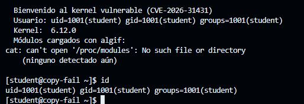
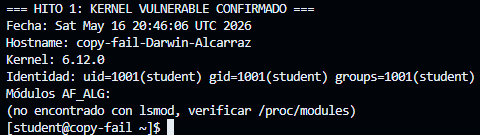

# Reporte Técnico: CVE-2026-31431

## Hito 1: Configuración del Entorno y Solución de Errores

Al principio tuve errores de compilación (Error 2 y 127) y un "Kernel Panic" (error -2). Esto pasaba porque los scripts buscaban rutas inexistentes, el contenedor no tenía recursos suficientes y el kernel no podía ver el archivo `/init`.

Para solucionarlo y arrancar QEMU con éxito, hice lo siguiente:

* **Corrección de rutas y scripts:** Como la carpeta se renombró a `copy-fail-challenge-1`, usé `sed` para actualizar las rutas en `01_build_kernel.sh`. Al corregir y cambiar la lógica de los scripts 01 y 02, se solucionó el Kernel Panic.
* **Instalación de dependencias:** Instalé `xz-utils` con `apt-get install` para poder descomprimir el kernel, ya que el contenedor no lo incluía.
* **Gestión de memoria:** Limpié los archivos temporales corruptos y configuré la compilación para usar un solo núcleo. Esto evitó que el Codespace se colgara por falta de recursos.

Tras esto, la VM arrancó perfectamente y obtuve el prompt del usuario `student`.

**Confirmación de la Vulnerabilidad :**
Una vez dentro de la VM, ejecuté comandos como `uname -r` e `id` para validar el entorno. Al intentar generar el reporte de evidencia, el directorio `/tmp` me dio error de permisos (`Permission denied`), por lo que redirigí la salida a la ruta personal `~/hito1.txt`. Finalmente, copié el resultado impreso, creé el archivo físico en la carpeta `evidence/` del Host y subí los cambios aplicando el commit y el tag `hito-1` requeridos por la guía.

  

# Hito 2

## Problemas y soluciones

Durante la ejecución del hito 2 me encontré con varios problemas que tuve que ir resolviendo uno por uno.

El primer problema fue que el kernel no tenía soporte de módulos, lo que impedía cargar `algif_aead`. Lo resolví agregando `CONFIG_MODULES=y` al archivo `.config` del kernel y recompilando desde cero.

Luego me di cuenta de que los módulos de crypto necesarios como `authencesn`, `hmac`, `aes` y `cbc` tampoco estaban disponibles. Los habilité como módulos en la configuración del kernel y volví a compilar con `make bzImage modules`.

Otro problema fue que Python estaba incluido en la VM pero sin sus librerías, así que al intentar correr el exploit daba error de módulo no encontrado. Lo solucione copiando las librerías de Python del host directamente al initramfs.

También tuve problemas con la carga de módulos al arrancar la VM. El script de inicio usaba `modprobe` pero fallaba porque necesitaba permisos de root. Lo reemplacé por `insmod` con rutas absolutas para que funcionara desde el inicio del sistema.

Por último, el exploit buscaba `/usr/bin/su` que no existía, y además BusyBox no tenía el bit setuid activo. Creé un symlink hacia `/bin/su` y agregué `chmod 4755` al binario de BusyBox en el script de empaquetado.

## Resultado

Después de resolver todos estos problemas, el exploit funcionó correctamente y obtuve una shell con privilegios de root:

   